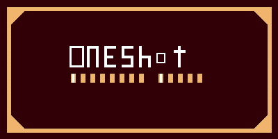

# OneShot Predator Nukem

A retro 2.5D first-person shooter game set in a Texas ranch, where players must eliminate wild hogs that have invaded the property. Built with WebGL and featuring classic FPS mechanics with modern web technologies.



## 🎮 Game Features

- **Retro 2.5D Graphics**: Classic sprite-based enemies with 3D environments
- **Texas Ranch Setting**: Authentic ranch environment with fences, barns, and open fields
- **Wild Hog Enemies**: Challenging AI-driven wild boar enemies
- **Weapon System**: Shotgun with realistic reload mechanics
- **Combat System**: Health, ammo management, and scoring
- **Audio Integration**: MIDI-style background music and sound effects
- **Performance Optimized**: Targets 60 FPS on desktop Chrome
- **Browser-Based**: No installation required, runs directly in web browser

## 🚀 Quick Start

### Option 1: Direct Browser Play
1. Open `final/index.html` in a modern web browser
2. Click "Start Game" to begin playing
3. Use mouse and keyboard controls to play

### Option 2: Local Web Server (Recommended)
```bash
# Navigate to the final directory
cd final

# Start a local web server (Python 3)
python3 -m http.server 8000

# Or using Node.js (if you have http-server installed)
npx http-server -p 8000

# Open browser and navigate to:
# http://localhost:8000
```

## 📋 System Requirements

### Minimum Requirements
- **Browser**: Chrome 80+, Firefox 75+, Safari 13+, Edge 80+
- **WebGL**: WebGL 1.0 support required
- **RAM**: 2GB available memory
- **CPU**: Dual-core processor
- **Input**: Mouse and keyboard

### Recommended Requirements
- **Browser**: Latest Chrome (for best performance)
- **WebGL**: WebGL 2.0 support
- **RAM**: 4GB available memory
- **CPU**: Quad-core processor
- **GPU**: Dedicated graphics card with WebGL acceleration

## 🎯 Game Controls

| Control | Action |
|---------|--------|
| **W A S D** | Move (Forward/Left/Backward/Right) |
| **Mouse** | Look around |
| **Left Click** | Shoot |
| **Right Click** | Aim (zoom) |
| **Space** | Jump |
| **Shift** | Sprint |
| **R** | Reload weapon |
| **Escape** | Pause menu |
| **F3** | Toggle performance stats |

## 🛠️ Development Setup

### Prerequisites
- Node.js 16+ (for development tools)
- Modern web browser with WebGL support
- Text editor or IDE

### Installation
```bash
# Clone or download the project
git clone <repository-url>
cd oneshot-predator-nukem

# No npm install required - pure vanilla JavaScript
# All dependencies are included or loaded via CDN
```

### Development Commands
```bash
# Start development server
npm run dev
# or
python3 -m http.server 8000

# Run integration tests
npm test
# or
node test_integration.js

# Run performance optimization
npm run optimize
# or
node optimize_performance.js

# Build for production (copies files to dist/)
npm run build
```

### NPM Scripts (package.json)
```json
{
  "name": "oneshot-predator-nukem",
  "version": "1.0.0",
  "scripts": {
    "dev": "python3 -m http.server 8000",
    "test": "node test_integration.js",
    "optimize": "node optimize_performance.js",
    "build": "cp -r final/ dist/",
    "start": "npm run dev"
  }
}
```

## 📁 Project Structure

```
project/
├── final/                       # Final web build (PLAY HERE)
│   ├── index.html              # Main game page
│   ├── js/                     # Game engine and logic
│   │   ├── main.js             # Main game entry point
│   │   ├── GameStateManager.js # Game state management
│   │   ├── MinimapRenderer.js  # Minimap rendering
│   │   ├── PerformanceMonitor.js # Performance tracking
│   │   └── AssetPreloader.js   # Asset loading optimization
│   ├── css/                    # Styling
│   │   └── style.css           # Main stylesheet
│   ├── assets/                 # Game assets
│   │   ├── sprites/            # Enemy and item sprites
│   │   ├── textures/           # Wall and floor textures
│   │   ├── audio/              # Music and sound effects
│   │   └── *.png               # Logo and UI images
│   ├── shaders/                # WebGL shaders
│   └── config.json             # Game configuration
├── src/                        # Source code
│   ├── engine/                 # Core game engine
│   │   ├── core/               # Engine core (Engine.js, GameObject.js)
│   │   ├── rendering/          # Rendering system
│   │   ├── audio/              # Audio management
│   │   ├── input/              # Input handling
│   │   ├── collision/          # Collision detection
│   │   └── utils/              # Utility functions
│   ├── game/                   # Game-specific logic
│   │   ├── Game.js             # Main game class
│   │   ├── LevelManager.js     # Level management
│   │   ├── CombatManager.js    # Combat system
│   │   ├── WeaponSystem.js     # Weapon mechanics
│   │   ├── EnemySystem.js      # Enemy AI and behavior
│   │   └── *.js                # Other game systems
│   └── assets/                 # Asset sources
├── docs/                       # Documentation
├── test_integration.js         # Integration tests
├── optimize_performance.js     # Performance optimization
└── README.md                   # This file
```

## 🎨 Game Architecture

### Engine Systems
- **Core Engine**: WebGL initialization, game loop, object management
- **Renderer**: 3D rendering with sprite billboarding
- **Camera**: First-person camera with mouse look
- **Input Manager**: Keyboard and mouse input handling
- **Audio Manager**: Sound effects and background music
- **Collision System**: 3D collision detection and response

### Game Systems
- **Level Manager**: Ranch environment generation and management
- **Combat Manager**: Health, damage, and combat mechanics
- **Weapon System**: Shotgun mechanics with ammo management
- **Enemy System**: Wild hog AI with pathfinding and behavior
- **UI System**: HUD, menus, and game state management

## 🔧 Configuration

Game settings can be modified in `final/config.json`:

```json
{
  "performance": {
    "targetFPS": 60,
    "enablePerformanceMonitoring": true
  },
  "graphics": {
    "resolution": { "width": 1280, "height": 720 },
    "pixelated": true,
    "antialiasing": false
  },
  "audio": {
    "masterVolume": 1.0,
    "musicVolume": 0.7,
    "sfxVolume": 0.8
  }
}
```

## 🚀 Deployment

### Local Deployment
1. Copy the `final/` directory to your web server
2. Ensure all files are accessible via HTTP/HTTPS
3. No server-side processing required

### Web Hosting Platforms
- **GitHub Pages**: Upload to repository, enable Pages
- **Netlify**: Drag and drop the `final/` folder
- **Vercel**: Deploy directly from repository
- **Firebase Hosting**: Use Firebase CLI to deploy

### CDN Deployment
```bash
# Example: Deploy to Firebase Hosting
firebase init hosting
firebase deploy
```

## 🐛 Troubleshooting

### Common Issues

**Game won't load:**
- Ensure WebGL is enabled in browser
- Check browser console for error messages
- Try a different browser (Chrome recommended)

**Poor performance:**
- Enable hardware acceleration in browser
- Close other browser tabs
- Check if integrated graphics are being used

**Audio not playing:**
- Check browser audio permissions
- Ensure volume is not muted
- Some browsers require user interaction before audio

**Controls not responding:**
- Click on the game canvas to focus
- Check if pointer lock is enabled
- Refresh the page and try again

### Debug Mode
Enable debug mode by adding `?debug=true` to the URL:
```
http://localhost:8000/?debug=true
```

This enables:
- Performance statistics overlay
- Console logging
- Debug information display

## 📊 Performance Optimization

The game is optimized for 60 FPS performance:

- **WebGL Optimization**: High-performance context, disabled antialiasing
- **Asset Preloading**: Efficient loading and caching system
- **Performance Monitoring**: Real-time FPS and frame time tracking
- **DOM Optimization**: Cached DOM queries and minimal updates
- **Memory Management**: Object pooling and garbage collection optimization

## 🤝 Contributing

1. Fork the repository
2. Create a feature branch
3. Make your changes
4. Test thoroughly
5. Submit a pull request

## 📄 License

This project is licensed under the MIT License - see the LICENSE file for details.

## 🙏 Acknowledgments

- Retro FPS games for inspiration
- WebGL community for technical resources
- Texas ranch culture for authentic setting
- Open source game development community

## 📞 Support

For issues, questions, or contributions:
- Create an issue in the repository
- Check the troubleshooting section
- Review the documentation in `docs/`

---

**Ready to hunt some hogs? Load up OneShot Predator Nukem and defend the ranch!** 🐗🔫